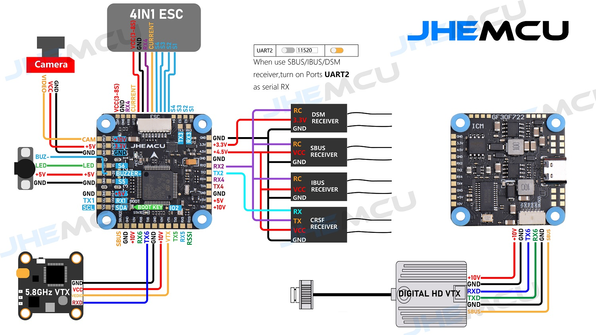

# JHEMCU GF30F722-ICM Flight Controller

### Specs:
**Flight control parameters**
* MCU: STM32F722RET6
* Gyroscope/Accelerometer: ICM-42688-P/Gyro/Accel
* OSD: AT7456E
* Barometer: BMP280
* Black box: 16MB
* I2C: Support
* Input voltage: 3-8S Lipo(11.4-36V)
* BEC: 5V-BEC: 5V/2.5A ±0.1V, 10V-BEC: 10V/2A(USER1)
* UART: UART1 (ELRS), UART2 (external RC), UART3, UART4, UART5, UART6
* USB: Type-C
* Size: 36 * 36 MM
* Mounting Hole: 30.5 * 30.5 * 4 MM
* Receiver: ELRS (CRSF), TBS (CRSF), SBUS, IBUS, DSM2, DSMX
* ESCsignal: PWM, Oneshot125, Oneshot42, Multishot, Dshot150, Dshot300, Dshot600
* Support programmable LED such as WS2812
* Support buzzer
* Built-in voltage and current sensors
* Weight: 8.8 grams

## Pinout

## UART Mapping

#####################################################Todo

The UARTs are marked Rn and Tn in the above pinouts. The Rn pin is the
receive pin for UARTn. The Tn pin is the transmit pin for UARTn.
|Name|Pin|Function|
|:-|:-|:-|
|SERIAL0|COMPUTER|USB|
|SERIAL1|RX1/TX1|USART1 (DMA) - Used by the on-board ELRS receiver, but TX1/RX1 pads are also available |
|SERIAL2|TX2/RX2|USART2 |
|SERIAL3|TX3/RX3|USART3 (DMA) - GPS, located near I2C pads|
|SERIAL4|TX4/RX4|UART4|
|SERIAL6|TX6/RX6|USART6 (DMA) - Telemetry|

## RC Input
 
RC input is configured on SERIAL1 (USART1) connected to the ELRS receiver, configured for CRSF with `SERIAL1_PROTOCOL 23`. 
*Note* A different target is available to should you want to run an external receiver on USART2 (RX2/TX2/SBUS). Note that PPM receivers are not supported as there is no timer resource available for this input. 
  
## OSD Support

The GSF405A supports OSD using OSD_TYPE 1 (MAX7456 driver).

## Motor Output

The built-in ESC is mapped to motor outputs 1-4. Bidirectional DShot is supported (requires flashing the ESC to a BLHeli_S version that supports bdshot, such as Bluejay [esc-configurator.com]).

## Battery Monitoring

The board has a built-in voltage and current sensors. 

The correct battery setting parameters are:

 - BATT_MONITOR 4
 - BATT_VOLT_PIN 11
 - BATT_VOLT_SCALE 11
 - BATT_CURR_PIN 13
 - BATT_CURR_SCALE 17

These are set by default in the firmware and shouldn't need to be adjusted

## Compass

The GSF405A does not have a builtin compass, but you can attach an external compass to the I2C pins.

## LED

The board includes a LED_STRIP output, which is assigned a timer and DMA. This is the fifth PWM output.

## Loading Firmware

Initial firmware load can be done with DFU by plugging in USB with the
bootloader button pressed. Then you should load the "with_bl.hex"
firmware, using your favourite DFU loading tool.

Once the initial firmware is loaded you can update the firmware using
any ArduPilot ground station software. Updates should be done with the
*.apj firmware files.
